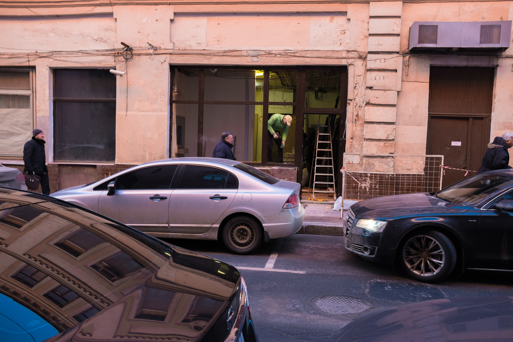
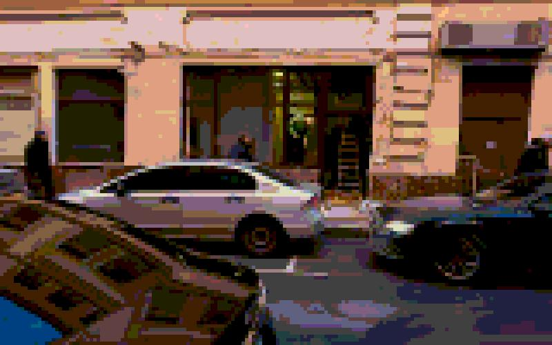
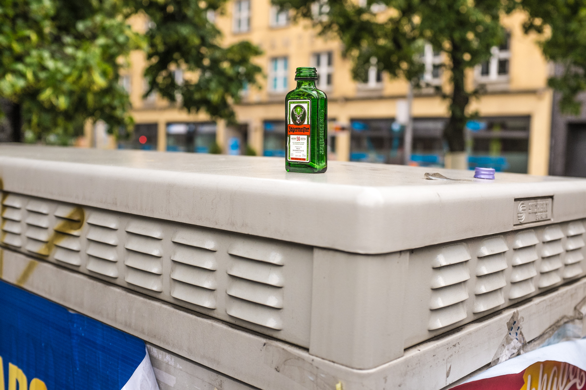
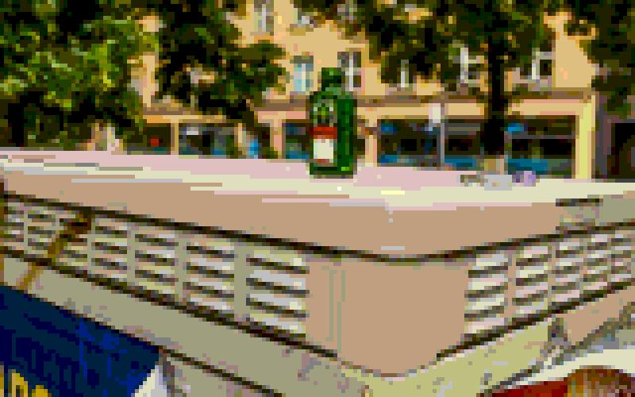

# Pixelartor ¯\_(ツ)_/¯

## Usage

```txt
usage: main.py [-h] [--right_pecrentile RIGHT_PECRENTILE]
               [--left_pecrentile LEFT_PECRENTILE] [--magnify] [--interlacing]
               [--edges_sigma EDGES_SIGMA]
               [--egdes_blur_sigma EGDES_BLUR_SIGMA]
               input_img output_img

positional arguments:
  input_img             Input image.
  output_img            Output image.

optional arguments:
  -h, --help            show this help message and exit
  --right_pecrentile RIGHT_PECRENTILE, -r RIGHT_PECRENTILE
                        Contrast stretching, right percentile, 98 as default.
                        Int in range [left percentile..100]
  --left_pecrentile LEFT_PECRENTILE, -l LEFT_PECRENTILE
                        Contrast stretching, left percentile, 4 as default.
                        Int in range [0..right_percentile]
  --magnify, -m         Increase size of the pixels.
  --interlacing, -i     Apply interlacing.
  --edges_sigma EDGES_SIGMA, -e EDGES_SIGMA
                        Sigma for canny filter.
  --egdes_blur_sigma EGDES_BLUR_SIGMA, -s EGDES_BLUR_SIGMA
                        Gaussian filter sigma.
```

## What is it for

Before:



After:



Before:



After:



## Gallery


